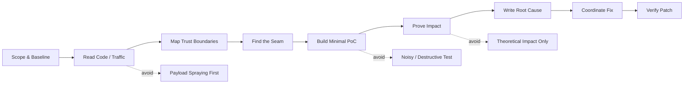

<!--
  Profile README · g2h / Gyu-hyeok Lee

  Redesign goals:
  - GitHub-compatible Markdown + HTML only
  - Modular terminal-dashboard layout
  - Original human ASCII portrait with leaf-perm hair and sunglasses
  - No custom CSS or JavaScript
  - Detailed research content preserved below the dashboard

  Account:
  - GitHub username: g2hsec
  - Profile repository: g2hsec/g2hsec
-->

<div align="center">


<p>
  
</p>

<p>
  <a href="https://github.com/g2hsec">
    
  </a>
  <a href="#selected-findings">
    
  </a>
  <a href="#research-focus">
    
  </a>
  <a href="#operating-model">
    
  </a>
</p>

<p>
  <a href="#mission">Mission</a>
  ·
  <a href="#selected-findings">Selected Findings</a>
  ·
  <a href="#research-focus">Research Focus</a>
  ·
  <a href="#operating-model">Operating Model</a>
  ·
  <a href="#toolbelt">Toolbelt</a>
  ·
  <a href="#github-signal">GitHub Signal</a>
  ·
  <a href="#contact">Contact</a>
</p>

</div>

---

<!-- =========================================================
     TERMINAL DASHBOARD
========================================================== -->

<table>
<tr>
<td width="27%" valign="top">

<p align="center">
  
</p>

<pre>
g2h@research:~$ whoami
security researcher
penetration tester

g2h@research:~$ focus
offensive security
vulnerability research
production-scope assessment

g2h@research:~$ principle
read deeply
prove cleanly
report precisely
coordinate responsibly
</pre>

<p align="center">
  
  
</p>

</td>
<td width="46%" valign="top">

<p align="center">
  
</p>

<pre align="center">
                ▄▄▄▄█▀▄▄▄  ▄ ▀█▄▄
            ▄▄▀▀▀   ██▄▄  ▀▄▀▀ ▀█████
          ▄███▀  ▄▄▀▀▀▄▄▀  ▄█▀▀▀▀▄▄ ▀▀▄▄
        ▄█████▀██ ▄▄    ▀    ▀▀▄▄ ██▄▀▀██
     ▀███▀██▀▀█▀ ██  ▄▀▀   ▀▀█▄▀██ ▀██▄ ██▄▄▄
    ▄▀▀▄▀ █▀ ▄████ ██ ▄▀▀ ▀█▄ █▄▀██ █ ▀▀▀███
   ▄▄▄█▀▄█▄▄▀▀▀███▄████▄  ▄ ████ ███ █▄  ▀█▄█
     ████▄   ▄███▀████ ██████▀█▀█ █▀▄  ▀▀ ▄███▀
   ▄██▄██ ▀▀▀▀ ▄▀▄█▄▀█▄████▀█▄█▄▀█▀▄ ▀▄  ███▄ ▀
      █▀██▀   ▄  ▀▄█▄▀▀████▄██ █ █▄ ▀█ ▀▄███▀▀
     ▀▀█▀   ▄▀▀▄▄▀▀▀▀▄▄████████▄█▄▀██ █   ▄██
▄      █▄ ▄▄  ▄█▄██▄ ▄▄▄█████▄▄▄▄███▄▄  ▄▄▀█
        ▀█▄██▀█         ████▀        ████▄█
         ▀██▄██         ████▄        ██ ██▀
          ▀█▄███▄     ▄██████▄     ▄▄██▄█▀
            ▀█▀████████████████████████▀
       ▄▄▀█    ▀██████████▄█████████    ▀▀▄
      ██ ▀      ▀██████████████████▀       ▀▀▄
     █ █   ▄▄    ▄▀███████████████  ▀▄▄▄   █ ██
     █ ▀▄ █▀ ▄   ██ ▀██████████▀ █     ▀█ ▄▀ ▄█
   ▄█▀█▄ ▀▄▄ █   ███▄ ▀▀████▀   ██     ▄█▀  ▄▀█▄
  ▄▀   ▀▄   ▀▄   █████▄       ▄███▄  ▄▀▀  ▄▀   ▀█
  ▀▄▄▄▄   ▀▄   ▀█████████▄   ▄███▀█▀▀  ▄▀▀   ▄▄▄█
▄▀▀█▄  ▀ ▄  ▀▀▄  ▀▀█████████████▀▀  ▄▀    ▄▀    ▀▀
▀         ▀▄   ▀ ▄ ▄█████████▀█  ▄█▀  ▄▄▀
             ▀▀   ▀█▀  ▀▄ ▄▀  █▀▀   ▀▀
                   █          █
</pre>

<p align="center">
  <code>leaf-perm</code>
  ·
  <code>sunglasses</code>
  ·
  <code>minimal-noise</code>
</p>

<p align="center">
  <b>Security Researcher · Penetration Tester</b><br/>
  <sub>Read code. Map trust. Find seams. Prove impact.</sub>
</p>

</td>
<td width="27%" valign="top">

<p align="center">
  
</p>

<p>
  <b>Spring Boot</b><br/>
  <code>CVE-2026-22731</code><br/>
  <code>CVE-2026-22733</code><br/>
  <sub>Actuator authentication boundary bypass</sub>
</p>

<hr/>

<p>
  <b>Spring Framework</b><br/>
  <code>CVE-2026-22735</code><br/>
  <code>CVE-2026-22737</code><br/>
  <sub>SSE framing and template path resolution</sub>
</p>

<hr/>

<p>
  <b>Grafana</b><br/>
  <code>CVE-2026-27877</code><br/>
  <code>CVE-2026-21727</code><br/>
  <sub>Datasource exposure and tenant isolation</sub>
</p>

<p align="center">
  
</p>

</td>
</tr>
</table>

<table>
<tr>
<td width="34%" valign="top">

<p align="center">
  
</p>

<ul>
  <li><b>Web:</b> auth boundaries, tenant isolation, logic flaws</li>
  <li><b>Mobile:</b> deep links, local storage, IPC, runtime trust</li>
  <li><b>Internal:</b> pivots, identity, sessions, CI/CD trust paths</li>
  <li><b>AI × Offensive:</b> recon synthesis, source triage, report precision</li>
</ul>

<p align="center">
  
</p>

</td>
<td width="32%" valign="top">

<p align="center">
  
</p>

<pre>
01  Read code / traffic
          ↓
02  Map trust boundaries
          ↓
03  Find the seam
          ↓
04  Build minimal PoC
          ↓
05  Prove concrete impact
          ↓
06  Coordinate the fix
</pre>

<p align="center">
  
</p>

</td>
<td width="34%" valign="top">

<p align="center">
  
</p>

<p align="center">
  
  
  
  
  
  
  
  
  
  
  
  
</p>

<p align="center">
  <sub>Recon · source review · runtime analysis · deterministic PoC</sub>
</p>

</td>
</tr>
</table>

<table>
<tr>
<td width="50%" valign="top">

<p align="center">
  
</p>

<table>
<tr><td><b>GitHub</b></td><td><a href="https://github.com/g2hsec"><code>g2hsec</code></a></td></tr>
<tr><td><b>Research style</b></td><td>code-first · PoC-driven</td></tr>
<tr><td><b>Public signal</b></td><td>CVE credits · technical writeups</td></tr>
<tr><td><b>Disclosure</b></td><td>vendor-coordinated</td></tr>
<tr><td><b>Main surfaces</b></td><td>web · mobile · internal</td></tr>
</table>

<p align="center">
  
</p>

</td>
<td width="50%" valign="top">

<p align="center">
  
</p>

<table>
<tr>
<td><b>GitHub</b></td>
<td><a href="https://github.com/g2hsec"><code>github.com/g2hsec</code></a></td>
</tr>
<tr>
<td><b>LinkedIn</b></td>
<td><a href="https://linkedin.com/in/leegyuhyeok"><code>linkedin.com/in/leegyuhyeok</code></a></td>
</tr>
<tr>
<td><b>PGP</b></td>
<td><code>[fingerprint]</code></td>
</tr>
<tr>
<td><b>Disclosure</b></td>
<td>coordinated disclosure preferred</td>
</tr>
</table>

<p align="center">
  
</p>

</td>
</tr>
</table>

<div align="center">

<h3>Read deeply. Prove cleanly. Report precisely. Coordinate responsibly.</h3>

<p>
  
  
  
</p>

</div>

---

<a id="mission"></a>

## Mission

I work in **offensive security**: penetration testing, vulnerability research, and production-scope security assessment across web, mobile, and internal systems.

My work focuses on the places where real systems disagree about trust:

- an application route and a framework route disagree about authentication;
- a public object accidentally expands into private configuration;
- a tenant boundary depends on legacy metadata;
- a client-side assumption is treated as a server-side guarantee;
- a parser, template engine, stream, proxy, or framework interprets the same value differently.

<p>
  
  
  
</p>

---

## Operating principles

<table>
<tr>
<td width="50%" valign="top">

### 01 · Read before fuzzing

Most reportable bugs are hidden in logic, not payload lists.  
I start with source, traffic, routes, roles, state, and assumptions.

</td>
<td width="50%" valign="top">

### 02 · Model the boundary

The target is rarely just an endpoint.  
The target is usually a boundary: auth, tenant, session, origin, parser, framework, ownership, or trust.

</td>
</tr>
<tr>
<td width="50%" valign="top">

### 03 · Prove with minimum noise

A finding should have a deterministic PoC, pinned preconditions, and a clean reproduction path.  
No destructive test. No “probably exploitable.” No vague impact claim.

</td>
<td width="50%" valign="top">

### 04 · Write for the fix

The report should explain the vulnerable path, the failing invariant, the concrete impact, and the patch direction.

</td>
</tr>
</table>

---

<a id="selected-findings"></a>

## Selected findings

> Six CVEs credited in 2026. Full version matrices, affected configurations, and vendor-specific details live in each advisory.

<details open>
<summary><b>Spring Boot · Actuator authentication bypass</b></summary>

<br/>

<p>
  <a href="https://spring.io/security/cve-2026-22731/">
    
  </a>
  <a href="https://spring.io/security/cve-2026-22733/">
    
  </a>
</p>

Application endpoints declared under Actuator Health-group or CloudFoundry paths are served without authentication.

- **Affected line:** Spring Boot `2.7 → 4.0`
- **Bug class:** framework integration / authentication boundary confusion
- **Core issue:** Actuator path mapping can win over the application's intended security configuration.
- **Impact style:** unauthenticated access to protected application paths under specific endpoint mappings.

</details>

<details open>
<summary><b>Spring Framework · MVC / WebFlux flaws</b></summary>

<br/>

<p>
  <a href="https://spring.io/security/cve-2026-22735/">
    
  </a>
  <a href="https://spring.io/security/cve-2026-22737/">
    
  </a>
</p>

- **CVE-2026-22735:** SSE stream corruption through unvalidated newlines in `SseEmitter` / `ServerSentEvent` `id` and `event` fields.
- **CVE-2026-22737:** script-template path traversal where JRuby/Jython template views can resolve files outside configured locations.
- **Bug class:** parser boundary / stream framing / path resolution
- **Impact style:** downstream framing corruption and template path boundary bypass.

</details>

<details open>
<summary><b>Grafana · Datasource exposure & tenant boundary weakness</b></summary>

<br/>

<p>
  <a href="https://grafana.com/security/security-advisories/cve-2026-27877">
    
  </a>
  <a href="https://grafana.com/security/security-advisories/cve-2026-21727/">
    
  </a>
</p>

- **CVE-2026-27877:** public dashboards leak passwords for all direct data sources, even when those data sources are not referenced by the public dashboard.
- **CVE-2026-21727:** legacy `org_id = 0` correlation records cross the tenant boundary, allowing a datasource-management user to read and permanently delete another organization's correlation data.
- **Bug class:** sensitive data exposure / multi-tenant authorization flaw
- **Boundary:** public dashboard → private datasource config / organization isolation
- **Research theme:** shared platform metadata accidentally crossing tenant or visibility boundaries.

</details>

<details>
<summary><b>Finding validation model</b></summary>

<br/>

Every report I send should be reproducible without guessing.

- **Root cause:** the code path, framework behavior, or trust-boundary mismatch
- **Preconditions:** exact version, configuration, role, endpoint, and state
- **PoC:** minimal, deterministic, non-destructive reproduction
- **Impact:** concrete security consequence, not theoretical language
- **Fix direction:** patch suggestion aligned with the actual source
- **Verification:** how to prove the fix closes the bug

</details>

---

<a id="research-focus"></a>

## Research focus

<table>
<tr>
<td width="50%" valign="top">

### Web security

Server-side logic flaws, authentication and authorization boundaries, IDOR, tenant isolation, SSRF, deserialization, and API design mistakes that scanners often miss.

<p>
  
  
  
  
</p>

</td>
<td width="50%" valign="top">

### Mobile security

Android / iOS client-server trust assumptions, insecure local storage, IPC and deep-link abuse, pinning bypass, and backend APIs reachable outside the app.

<p>
  
  
  
  
</p>

</td>
</tr>
<tr>
<td width="50%" valign="top">

### Penetration testing

Internal network pivots, identity and session weaknesses, CI/CD trust paths, supply-chain exposure, and end-to-end attack chains instead of single-issue pokes.

<p>
  
  
  
  
</p>

</td>
<td width="50%" valign="top">

### AI × Offensive Security

How LLMs actually help during real engagements: recon synthesis, source triage, payload generation, finding deduplication, and report drafting without losing technical precision.

<p>
  
  
  
  
</p>

</td>
</tr>
</table>

---

<a id="operating-model"></a>

## Operating model



```text
1. read the code      ── threat model, trust boundaries, expected invariants
2. find the seam      ── where two components disagree about the same path/value
3. prove it           ── deterministic PoC, pinned environment, minimal dependencies
4. write it up        ── code path + condition + impact, no speculation
5. coordinate         ── disclose, patch review, fix verification
```

---

<a id="toolbelt"></a>

## Toolbelt

### Offensive workflow

<p>
  
  
  
  
  
</p>

### Code, PoC, and reverse workflow

<p>
  
  
  
  
  
  
</p>

### Lab and infrastructure

<p>
  
  
  
  
  
  
</p>

### How I use tools

| Phase | Tools | Purpose |
|---|---|---|
| **Recon** | `subfinder`, `httpx`, `ffuf`, `nuclei`, OSINT flows | Build a map, not just a list |
| **Read** | Burp, source review, `ripgrep`, IDE navigation | Understand invariants before testing |
| **Prove** | Python, Go, short PoC harnesses | Deterministic reproduction |
| **Mobile** | Frida, objection, device/emulator labs | Validate client-server trust assumptions |
| **Pivot** | Docker, ESXi, pfSense, GitLab, Jenkins | Build realistic attack chains |
| **AI** | Local/API LLMs in the workflow | Assist triage, not replace judgment |

---

<a id="github-signal"></a>

## GitHub signal

<div align="center">

<p>
  <a href="https://github.com/g2hsec">
    
  </a>
  <a href="https://github.com/g2hsec?tab=followers">
    
  </a>
  <a href="https://github.com/g2hsec/g2hsec/commits/main">
    
  </a>
</p>

</div>

### Public research profile

```text
primary work      offensive security, vulnerability research, pentest
research style    code-first, PoC-driven, vendor-coordinated
main surfaces     web, mobile, internal network, framework boundaries
public signal     CVE credits, advisory collaboration, technical writeups
```

<p>
  
  
  
  
</p>

<details>
<summary><b>Dynamic GitHub cards</b></summary>

<br/>

These cards depend on third-party dynamic image services. If they fail to load, the profile still works without them.

<div align="center">

<a href="https://github.com/g2hsec">
  
</a>

<a href="https://github.com/g2hsec">
  
</a>

<br/>

<a href="https://git.io/streak-stats">
  
</a>

</div>

</details>

---

<a id="contact"></a>

## Contact

```text
github    github.com/g2hsec
linkedin  linkedin.com/in/leegyuhyeok
pgp       [fingerprint]
```

Coordinated disclosure preferred for vendor issues.

Open to collaboration on offensive engagements, secure code review, and research on applying LLMs to real pentest workflows — not demo-ware.

---

<div align="center">

<h3>Built around one rule</h3>

<p><b>Read deeply. Prove cleanly. Report precisely. Coordinate responsibly.</b></p>


</div>
