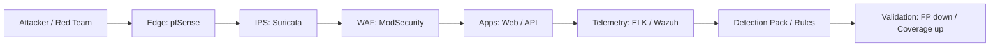

# g2h

**Security Research · Red Team · Detection Engineering**

`Evidence-first` · `Reproducible PoC` · `Code-level root cause` · `Practical impact`

 

  
  
  
  

  <a href="#cve-portfolio">CVE</a> ·
  <a href="#featured">Featured</a> ·
  <a href="#proof">Proof</a> ·
  <a href="#capabilities">Capabilities</a> ·
  <a href="#tooling">Tooling</a> ·
  <a href="#lab--research">Lab</a> ·
  <a href="#contact">Contact</a>

---

## Executive Snapshot

> Discover → Prove → Explain → Fix / Detect.
> Every finding is closed end-to-end — from the broken boundary in code to a tuned rule in telemetry.

> **Credited reporter** — Spring Boot Actuator authentication-bypass family (CVE-2026-22731 / 22733 / 22735 / 22737) · Grafana Correlations cross-tenant isolation (CVE-2026-21727) · Grafana public-dashboards credential exposure (CVE-2026-27877).

<table>
<tr>
<td valign="top" width="50%">

### Work
- **Vulnerability research** with strict threat modeling and boundary analysis
- **Pentest / Red team** aligned to enterprise realities
- **Detection engineering** with validated telemetry and tuning

</td>
<td valign="top" width="50%">

### Deliverables
- **PoC bundles** — deterministic steps, env assumptions, evidence
- **Patch guidance** — root cause + minimal-risk fix strategy
- **Detection pack** — rules + mapping + validation notes

</td>
</tr>
</table>

---

## CVE Portfolio

| CVE ID | Vendor / Product | Category | Severity | Published |
|:---|:---:|:---:|:---:|:---:|
| [`CVE-2026-27877`](https://grafana.com/security/security-advisories/cve-2026-27877) | Grafana | `CWE-200` Info Disclosure | **Medium** · 6.5 | 2026-03-27 |
| [`CVE-2026-22731`](https://spring.io/security/cve-2026-22731/) | Spring Boot (Actuator) | `CWE-288` Auth Bypass | **High** · 8.2 | 2026-03-19 |
| [`CVE-2026-22733`](https://www.cve.org/CVERecord?id=CVE-2026-22733) | Spring Boot (Actuator CF) | `CWE-288` Auth Bypass | **High** | 2026-03-19 |
| [`CVE-2026-22735`](https://www.cve.org/CVERecord?id=CVE-2026-22735) | Spring Boot (Actuator) | `CWE-288` Auth Bypass | **High** | 2026-03-19 |
| [`CVE-2026-22737`](https://www.cve.org/CVERecord?id=CVE-2026-22737) | Spring Boot (Actuator) | `CWE-288` Auth Bypass | **High** | 2026-03-19 |
| [`CVE-2026-21727`](https://grafana.com/security/security-advisories/cve-2026-21727/) | Grafana (Correlations) | Cross-Tenant Isolation | **Low** · 3.3 | 2026-01-29 |

<b>Per-CVE details</b>

 

**CVE-2026-27877** — *Grafana public dashboards expose direct data-source credentials*
- Vendor: **Grafana** · CVSS **6.5 (Medium)** · `AV:N/AC:L/PR:L/UI:N/S:U/C:H/I:N/A:N`
- Root cause: When public dashboards use direct data sources, passwords of all direct data sources are returned in the response regardless of whether they are referenced by the dashboard.
- Advisory: <https://grafana.com/security/security-advisories/cve-2026-27877>

**CVE-2026-22731** — *Spring Boot — Auth bypass under Actuator Health group additional paths*
- Vendor: **Spring (VMware Tanzu)** · CWE-288 · CVSS **8.2 (High)** · `AV:N/AC:L/PR:N/UI:N/S:U/C:H/I:L/A:N`
- Affects: Spring Boot `3.4.0–3.4.14`, `3.5.0–3.5.11`, `4.0.0–4.0.3`
- Root cause: An application endpoint requiring authentication, declared under a path already configured as a Health Group additional path, is served without credentials — the Actuator path mapping overrides the app's auth.
- Reported by: **Gyu-hyeok Lee (g2h)** · Fixed: `3.4.15` / `3.5.12` / `4.0.4`
- Advisory: <https://spring.io/security/cve-2026-22731/>

**CVE-2026-22733** — *Spring Boot — Auth bypass under Actuator CloudFoundry endpoints*
- Vendor: **Spring** · CWE-288 · Related to CVE-2026-22731 (different preconditions / version ranges)
- Root cause: Similar auth-bypass pattern surfacing through the Actuator CloudFoundry endpoint exposure.
- Advisory: <https://www.cve.org/CVERecord?id=CVE-2026-22733>

**CVE-2026-22735** — *Spring Boot Actuator — Auth bypass (sibling of 22731/22733)*
- Vendor: **Spring** · CWE-288 · Advisory: <https://www.cve.org/CVERecord?id=CVE-2026-22735>

**CVE-2026-22737** — *Spring Boot Actuator — Auth bypass (sibling of 22731/22733)*
- Vendor: **Spring** · CWE-288 · Advisory: <https://www.cve.org/CVERecord?id=CVE-2026-22737>

**CVE-2026-21727** — *Grafana — Cross-Tenant Legacy Correlation Disclosure and Deletion*
- Vendor: **Grafana** · CVSS **3.3 (Low)** · `AV:N/AC:H/PR:H/UI:N/S:U/C:L/I:L/A:N`
- Root cause: A backward-compatibility condition returned `org_id = 0` correlation records across organizations. A user with datasource-management privileges could read and permanently delete legacy correlation data belonging to another tenant.
- Fixed in: `≥12.3.3`, `≥12.2.4 <12.3.0`, `≥12.1.6 <12.2.0`, `≥12.0.9 <12.1.0`, `≥11.6.11 <12.0.0`
- Credit: **Gyu-hyeok Lee (g2h)** · Advisory: <https://grafana.com/security/security-advisories/cve-2026-21727/>

---

## GitHub Activity

  

---

## Featured

<table>
<tr>
<td valign="top" width="50%">

### Spring Boot Actuator — Auth Bypass via Health Group Additional Paths
- **CVE** · [CVE-2026-22731](https://spring.io/security/cve-2026-22731/)
- **Category** · CWE-288 (Authentication Bypass Using Alternate Path)
- **Severity** · **High** · CVSS 8.2 · `AV:N/AC:L/PR:N/UI:N/S:U/C:H/I:L/A:N`
- **Affected** · Spring Boot `3.4.0–3.4.14`, `3.5.0–3.5.11`, `4.0.0–4.0.3`
- **Impact** · Unauthenticated access to app endpoints declared under a Health Group additional path; sensitive Actuator-adjacent routes reachable without credentials.
- **Root cause** · Actuator path registration takes precedence over application security mappings when the app endpoint path collides with a Health Group additional path.
- **Credit** · Reported by **g2h** · Fixed in `3.4.15` / `3.5.12` / `4.0.4`

</td>
<td valign="top" width="50%">

### Grafana — Direct Data-Source Credential Exposure in Public Dashboards
- **CVE** · [CVE-2026-27877](https://grafana.com/security/security-advisories/cve-2026-27877)
- **Category** · CWE-200 (Exposure of Sensitive Information)
- **Severity** · **Medium** · CVSS 6.5 · `AV:N/AC:L/PR:L/UI:N/S:U/C:H/I:N/A:N`
- **Impact** · Public dashboards leak passwords of **all** direct data sources in the response, even ones not referenced by the dashboard. Proxied data sources are unaffected.
- **Prereq** · Grafana instance with public dashboards + direct data sources enabled
- **Assigner** · GRAFANA · Published `2026-03-27`

</td>
</tr>
<tr>
<td valign="top">

### `[tool / project #1]`

</td>
<td valign="top">

### `[tool / project #2]`

</td>
</tr>
</table>

---

## Proof

<table>
<tr>
<td valign="top" width="33%">

### Findings
- CVEs · **6 assigned (2026)**
- Advisories · [link](#)
- Writeups · [link](#)

</td>
<td valign="top" width="33%">

### Programs
- HackerOne · [profile](#)
- Intigriti · [profile](#)
- VDPs · [index](#)

</td>
<td valign="top" width="33%">

### Artifacts
- PoC bundles
- Detection packs
- Lab manifests

</td>
</tr>
</table>

<b>Evidence standard — what I attach</b>

 

| Section | Content |
|:---|:---|
| Root cause | Code path, condition, boundary broken |
| Reproduction | Exact steps, environment assumptions |
| Evidence | Logs, pcap, requests, before/after diffs |
| Risk | Practical impact narrative (not speculative) |
| Fix | Minimal-risk remediation + regression notes |

---

## Capabilities

<table>
<tr>
<td valign="top" width="50%">

### Offensive
- **Web / API** — authz/IDOR, injection, SSRF, deserialization, business logic
- **Multi-tenant** — org isolation, token scopes, delegated access abuse
- **Supply chain** — CI/CD abuse paths, secrets, artifact integrity

</td>
<td valign="top" width="50%">

### Defensive
- **Detection** — Suricata / Zeek / Sigma logic, tuning, validation
- **IR** — triage playbooks, evidence capture, timeline reconstruction
- **Signal engineering** — noise filters, correlation, enrichment

</td>
</tr>
</table>

---

## Tooling

  
  
  
  
  
  
  
  
  
  
  
  

| Area | Stack |
|:---|:---|
| Languages | Python · Bash · Go · JavaScript |
| Security | Burp Suite · ffuf · nuclei · Suricata · Zeek · Sigma · ELK · Wazuh |
| Infra / Lab | Docker · VMware / ESXi · pfSense · GitLab · Jenkins |

---

## Lab & Research

> Realistic lab validating both exploitation and detection in the same pipeline.

- **Segmentation** — DMZ / Corp / Dev
- **Controls** — WAF (ModSecurity) · IPS (Suricata) · centralized telemetry (ELK / Wazuh)
- **Scenarios** — CI/CD chain (GitLab → Jenkins → deploy), adversary emulation, detection validation

---

## Contact

  
  
  
  

Open to collaboration on vulnerability research, red-team engagements, and detection engineering.

